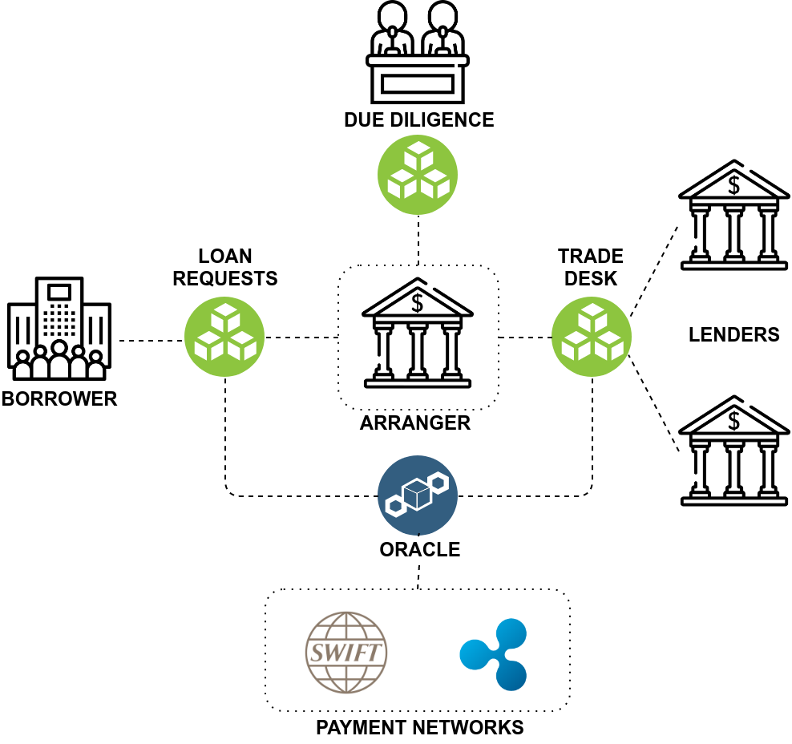

# About SyndLend

**SyndLend is a Distributed ledger technology based syndicated loan platform to create a speedy, cost efficient, transparent yet compliant market place between loan borrowers, investors and arranging banks**

## Features



Instant and easy deployment to devise an efficient syndicated loan market



Each entity receives all the relevant information about the loan, market status without having to trust the single source



Integration of the token system and instant verification through smart contracts speeds up the settlement time



## Architecture

SyndLend is architected in such a way that the participants, namely, loan borrowers, lenders, agents, and arranging banks share and communicate deal information on a need to know basis by creating private transactions.

## Implementation Phases



A marketplace where loan requests and proposals are validated and finally loans are syndicated



An obligation will be created to extend the loan to the borrower after the loan was finalized and syndicated.



Regular loan repayments as per schedule and loan default scenarios are handled here.



