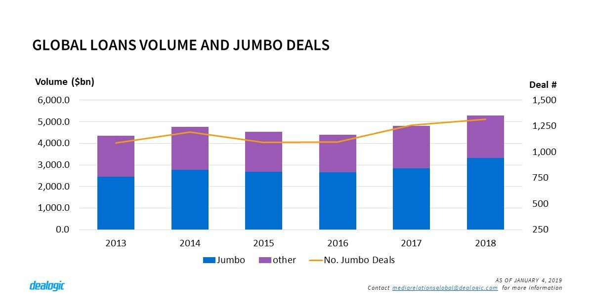
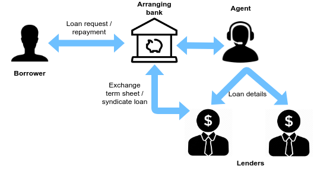
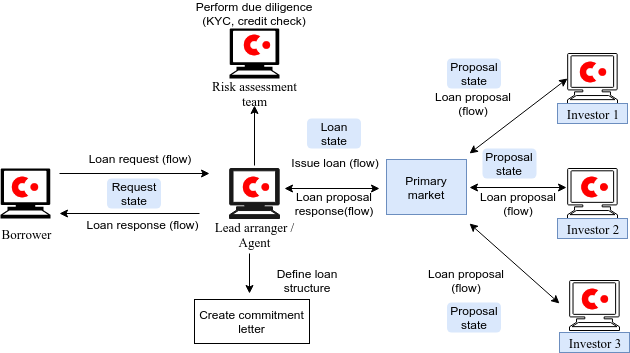
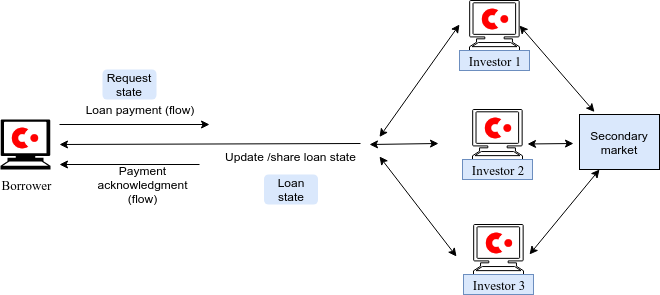
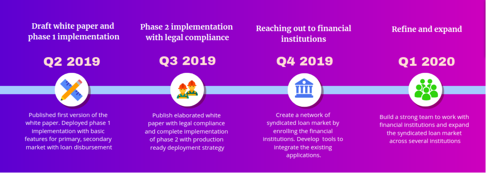

# SyndLend - Whitepaper

## Introduction

A distributed ledger which consists of mutually distrusting nodes may create architecture for a single global database that records the state of deals, obligations and other agreements between agents, borrowers, and lenders \(investors\) with regard to borrowing/ lending transactions. This distributed ledger would eliminate much of the manual, time-consuming effort currently required to keep disparate ledgers synchronized with each other. It would also allow for greater levels of objective and legally enforceable information sharing that is currently typical in the financial and other industries, reducing transactions costs for everyone. We present **SyndLend**, a software implementation which is designed to achieve these goals and a network that is based on the Corda platform. This paper provides a high-level introduction to the proposed application.

## About

With a dedicated team of people having served in financial and blockchain technology areas, we seek to identify the predicaments in the existing financial frameworks and design a powerful solution with innovative technology. We have identified that distributed ledger technology provides resolution to most of the broken flow in the existing frameworks. The syndicated loan market is one such area in finance where innovation was needed to bring a drastic change to the existing infrastructure. After doing immense research in this field, we have devised a lending platform — SyndLend to provide an effective explication to the syndicated loan market.

### Vision

We see a future, wherein any credible borrower may approach any willing lender seamlessly and any investor looking for attractive lending opportunities will be able to find and invest, through a fully automated, reliable, dis-intermediated yet compliant process, thus creating a business environment to grow within and outside their established domains, with capital itself following the promising business opportunities.

### Mission

In order to achieve the outlined Vision, our mission is to simplify adoption of blockchain technologies that help reduce the cost and complexity of syndicating loans, while ensuring trust, transparency, efficiency, and authenticity on a distributed ledger platform that provides complete auditability.

### Principal features

A loan syndicated platform supported by distributed ledger technology is expected to revolutionize lending/ borrowing activity to drive economic change on a global scale because the transactions undertaken on the platform are immutable, transparent, trusted in the trustless atmosphere, secure and fast with easy, but with authorized accessibility. The central technical innovation is the mechanism to synchronize data using _digital ledger technology \(_ DLT\) The distributed storage facility characterizes that at any point of time everyone has a copy of the exact same database and if any of the nodes fail, for example, a specific lender’s server crashes, there is no loss of information. Further, the real world actions shall be automatically triggered not by specific entity’s choice or willingness, or rather unwillingness, but out auto validation of trigger condition. For lenders, upon commitment, the Blockchain platform will automatically trigger notices to give effect to the transfer of loan amounts. Similarly, on agreed due dates, the borrower's bank accounts shall automatically wire the due amounts related with loan installments and interest payments.

The shared uses of the data and money flow have the following beneficial effects:

* Reduction in the costs with improved efficiency as to loan syndicated process.
* A high degree of improvement in reconciliation and remediation
* Security creation \(mortgage\) is easier, transparent and effective.
* Enforcement in case of defaults is easier, efficient and automatic
* Transaction data is verifiable, accurate, and consistent, so it is always reliable.

## Market

### Global landscape

The Global syndicated loans volume touched $5.28tr in 2018, up by 10% from 2017 despite a fall in activity from 10,180 to 9,733 deals. In fact, the 2018 volume has been supported by jumbo deals which saw a marginal YoY rise in activity by 58 deals, yet volume jumped more significantly by 17%. Although re-financings accounted for 57.9% of all jumbo facilities, jumbo M&A-related deals witnessed a sizeable increase from $ 620.1bn last year to $874.3bn in 2018. In fact, the top 5 largest loans in 2018, which include Disney $37.5bn and Takeda $30.9bn, were all for acquisition purposes.  

_Figure 1. Global loans volume and jumbo deals \(source:_ [_https://www.dealogic.com_](https://www.dealogic.com/)_\)_

Financial sponsor-backed facilities accounted for 69.3% of LevFin – institutional loans & HY – revenue in 2018, up by 8.4 points year-on-year. New institutional LBO volume in both the US and Europe increased by 40%, leading to a healthy jump in the wallet by $1.4bn year-on-year. 2018 saw the institutional leveraged loans wallet in the US reach $8.2bn, a new record level amidst a fading HY market. HY in 2018 was marred by rising cov-lite structures accounting for more than 80% of US institutional loans volume, rising yields which put off issuers from tapping the DCM market, and a sharp reduction of non-financial sponsor facilities, down by 42% year-on-year. Likewise, European bankers enjoyed a record year from a LevFin wallet perspective with $2.6bn paid.

As bankers enjoyed a record payout, regulators and politicians are raising concerns on the level of indebtedness and investor protection. The volume of new jumbo LBOs for instance increased by 15% year-on-year. Similarly, subordinated loans in the US saw volume climbing from $30.4bn to $31.5bn and activity rise from 162 to 187 deals.

#### US marketed volumes

US-marketed loans volume totaled a record $2.92tr in 2018. The market was driven by investment-grade borrowers which increased both volume and activity by 37% and 15%, respectively. Leveraged loans which dominated issuance in 2017, saw a reduction in volume and activity from $1.66tr via 3,227 deals in 2017 to $1.49tr via 2,966 deals in 2018, this is mainly due to a reduction in refinancing levels after a record 2017 year. The investment grade market growth can be attributed to the huge growth in acquisition-related loans which increased by 63% year on year with an average deal size of $3.3bn, up from $3.1bn in 2017. Technology saw a huge jump from $75.2bn in 2017 to $162.5bn in 2018 driven by M&A-related facilities and refinancing which increased by 2.7x and 1.2x, respectively on 2017.  

#### European marketed volumes

The European Com.mission tendered in 2017 for a systemic analysis of the loan syndication market in six EU member states, and its possible implications on competition in credit markets. Syndicated lending is a type of debt financing in which several lenders come together to share credit risk, allowing a borrower to access a large-scale loan in a single loan facility agreement. Syndicated loans are a significant source of capital in the EU, with about €720 billion raised across Europe in 2017, according to the report.

#### Asian market

Syndicated lending in Asia-Pacific, excluding Japan, grew for the first time in four years in 2018, despite a slowdown in event-driven financings and rising volatility in equity and bond markets. Lending volumes in Asia-Pacific rose by 8.9% from US$445.31bn in 2017 to US$484.82bn, the second-biggest annual tally behind US$523bn in 2014. Australia, China, and Singapore posted significant growth after a surge in deal flow late in the year, according to LPC data, which tracks loans in international currencies comprising Australian, Hong Kong, Singapore, and Taiwan dollars, renminbi and the G3 currencies.

## Literature review

### Conventional system

The current system of loan syndication involves, typically one lead bank, who acts as an agent or intermediary and other participating banks along with a borrower. The agent bank/ entity or the lead bank drives the flow of the deal, with the fate of the deal strongly linked to the relationships that the Agent enjoys with the potential lenders. The borrower has to approach the Agent, or the Agent identifies the potential borrower and the syndication activity commences. The entire system thus gives the Agent, the pre-eminent position, with the possibility of abuse of misuse.

### Existing solutions

Existing solutions are largely based on the access to the centralized websites of the lenders, wherein standardized information has to be submitted in order to generate a lead for the Lender. The data so submitted only introduces the borrower to the lender, as thereafter, communication starts through email or physical mail processes or through phone calls or personal meetings. Details of the negotiations/ transactions are recorded in the respective digital files / physical files of the parties involved and the records may not mirror with each other.

### Pain points in the conventional system

The current system suffers from several inefficiencies. The exchange of information and data is done through various mechanisms — emails, faxes, telephonic communication, physical mails, and personal courier and meetings. There is no authentic record which can be maintained independently at a neutral place and the records themselves are liable to mutations. The lenders/ participants operating in different time zones face difficulty in timely communication which results in inefficiencies and delays. With regard to the default events, namely, there are no automatic triggers. The triggers themselves are subjected to subjective interpretations of the parties.

Even though the existing digitalized loan syndication platforms provide the solution to conquer a few of the inefficiencies, and digitize the records, the platform would be deployed and managed by the centralized lead bank. This will still conceive the possibility of abuse and misuse of the process.

## Distributed ledger technology

Distributed ledger technology \(DLT\) is a way of achieving the synchronization of data that are shared among the participants located in multiple locations. Achieving the consensus about the data that can be verified by every participant is the core essence of this technology. Although Bitcoin was the first practically implemented distributed ledger that solved the double spend issue associated with the transactions in a decentralized system, the scope of the solution was limited to only monetary transactions. The technology behind Bitcoin’s implementation paved a way to create several DLT based platforms that could be used to solve a wide range of use cases.

When the DLT implementation witnessed a tremendous scope in the enterprise use cases as well, several DLT platforms were created with features to cater to the needs of enterprise applications. These DLT platforms were designed with permissioned ledgers with a consensus mechanism that could scale to meet the computation demand of any use case. That is how enterprise blockchain platforms such as Corda, Quorum, Hyperledger project gained mass adoption in enterprise applications.

### Impact of DLT on loan syndication

As we discussed earlier, a conventional loan syndication process suffers from these problems:

1. Lack of information sharing among the participants of loan syndication. Even the shared information doesn’t have a fitting way to verify the authenticity
2. Delay in the entire loan syndication process
3. High cost involved to complete several phases of the settlement

Even when a loan syndication platform is devised to solve these issues, it still will not be free from these concerns due to the centralized record keeping nature of the platform. Further, it adds the following complexities.

1. Need for a data backup procedure to overcome data storage failure
2. A way to verify the authenticity of the transaction
3. A system to prove that there is no mutation of historical data

Any solution furnished by a third party platform always introduces all the above complexities. This is the very reason as to why there have not been many successfully functioning solutions to transform the traditional loan syndication process.

Fortunately, DLT is a revolutionary technology that promises decentralization of not just the data storage, but the entire economy itself. It overcomes the storage failure predicaments with replicated data management. As each and every event stored in the distributed ledger is a digitally signed transaction, the authenticity of the event can be verified conveniently. The data committed to the ledger maintains a globally consensual state. This guarantees an immutable ledger that stores entire transaction chain acting as a proof for any inquiry in case of disputes.

A DLT based loan syndication platform will ensure that it enjoys all the features of DLT to create a system that could be deployed in a completely trustless setting.

## Corda enterprise DLT

Corda is a DLT platform designed to provide an enterprise-grade solution to the financial use cases. Corda was not only created to solve complex use cases but also to mitigate the flaws in the public blockchain platforms such as Ethereum. Created by R3, collaborating with several financial institutions, Corda has emerged as the esteemed platform to solve financial use cases.

Due to all the rich set of features offered by Corda for an enterprise financial use case, it is an obvious choice for our syndicated loan platform. We will utilize all these features provided by Corda to architect our use case. Let’s discuss a few of the key features here.

### Features

In addition to the benefits provided by the DLT, Corda enhances the capabilities to suit the enterprise needs so that the solution can function even in a regulated environment.

Corda provides the following capabilities to create privacy preserved, scalable DLT ecosystem :

#### Transaction privacy:

Unlike the nodes in the public blockchain applications, the participants in the financial implementation don’t appreciate sharing every transaction detail with every other participant in the network. Corda provides a convenient way to share the transactions on a need to know basis and still achieve consensus among all the nodes.

#### Transaction finality:

Although most blockchain platforms are able to process the transactions at a fairly higher rate compared to Bitcoin, it will never provide a 100 % certainty regarding the transaction finality. Corda provides assurance that transaction achieves finality as soon as it reaches other participants in the network.

#### Scalability:

Corda ensures that the platform is scalable by allowing any scalable consensus algorithm to be plugged into the platform. Corda’s pluggable consensus mechanism allows the system to scale so that it could match the transaction rates of the global payment system.

#### Enterprise integration:

Corda uses technologies that are recognized and proven in enterprise solutions. This encourages easy adoption and integration to the existing implementations.

#### Legally identifiable entities:

Existing blockchain platforms provide only pseudo-anonymous identity in the network. Although these identities help to verify the transaction, it doesn’t assist much in a regulated environment. Corda provides a standard identity that can represent legal or service identity.

### Corda distributed application \(CorDapp\):

Corda platform allows bundling the entire business logic into a distributed application so that they can be conveniently deployed on every node in the network. Thes applications are known as CorDapps, and they are composed mainly of three components - states, flows, and contracts.

**States:** Corda states are the atomic unit of information that represents on-ledger facts. Every transaction will have zero or more states in inputs and zero or more states as outputs.

**Flows:** Corda flows provide a means of communication between the nodes and help to automate the common tasks and synchronize the ledger.

**Contracts:** Corda contracts are the deterministic verification script to ensure that the transaction maintains the valid states.

## Architecture

Now that we are familiar with the pain points of the traditional loan syndication platform and the benefits of the DLT based solution, we can envision an architecture of the syndicated loan market with the DLT. The architecture will depict most of the participants involved in the traditional syndicated loan market. So, let’s first debunk the participants involved in the traditional architecture as shown in figure 2.

_Figure 2. The architecture of a conventional syndicated loan market_

A simplest traditional syndicated loan market will consist of at least a lead arranging bank, agent along with the loan borrower and lenders. Since all these entities are indispensable elements of the syndicated loan market, when we architect the solution in DLT we would still maintain all these participants, although the way of exchange of information will vary here.

As we are going to approach the DLT based solution to the loan syndication using permissioned enterprise-based distributed ledger platform, we need to carefully design the assets, state, contract and the interaction between the entities so that it adheres to the existing judicial standards.

### 

### DLT based architecture

To architect the DLT based loan syndication market, we need to define the state management and interaction responsibilities of loan borrowers, lenders, agent and arranger banks. Corda platform provides a convenient way to handle the state change, interactions and impose validations with the help of Corda **states**, **flows**, and **contracts**.

#### 

#### Corda based architecture

An architectural representation of the DLT based loan syndication platform will consist of all the entities acting as Corda nodes with their own identities. These identities help to establish convenient communication during any type of event. Every node will run the Corda application \(CorDapp\) to trigger an event or fetch information during the loan syndication process. Each node performs these tasks with the help of flows that are defined in the CorDapp. Figure 3 shows the flows for the borrower, arranger/agent, risk assessment team and investors along with the states that will maintain the latest event information of the system.

_Figure 3. The Corda states and flows during the loan syndication process_

The entire loan syndication process on DLT can be classified into **loan issuance** \(disbursement\) and **loan repayment**. These 2 phases will occur at different instances based on the terms agreed on the term sheet. And these phases will have different flows for state transition. Let’s have a look at each of these phases.

**Loan issuance:**

The first phase in the loan syndication deals with trading the loans on the primary market. This phase comprises of loan request flow where the borrower initiates a request to the arranger bank. The arranger then places the loan in the primary market after certain background verification. Investors will create their proposals through proposal flows. Similarly, the arranger will syndicate the loans after reviewing these proposals. The borrower will receive the response along with the loan syndication details towards the end of this phase, after which loan will be disbursed.

**Loan repayment:**

Loan repayment phase is architected in a way such that the borrower will conveniently repay the loan without having to approach any intermediaries such as arranger bank. Figure 4 shows the Corda flows used during the loan repayment and the relevant states that are updated during this phase.

_Figure 4. The Corda states and flows during the successful loan repayment phase_

In case the borrower fails to repay the loan as agreed upon in the term sheet, flows related to default scenario would be triggered. In any case, the entire loan syndication process completes the cycle at the end of the loan repayment phase.

## Roadmap

The roadmap of the two-phase implementation of our project consists of high-level goals to achieve technical breakthroughs, legal compliance, and adaptability by financial institutions.

## Team

Our core team is comprised of financial and blockchain technology connoisseurs with a great amount of time spent on understanding issues in the existing financial infrastructure.

### Core team

**Koshik Raj**

Co-Founder

Koshik Raj is an information security enthusiast who holds a Master's degree in Computer Science & Information Security. He has a demonstrated history of working in RSA, a network security company. He has also worked as a Senior Developer in CoWrks, Bangalore. Currently, he devotes his entire time to research and work on the blockchain technology. He is a certified blockchain instructor for [https://icblockchain.com](https://icblockchain.com/) and [https://amityonline.com](https://amityonline.com/). He has authored a book on blockchain technology titled: [Foundations of Blockchain](http://author.koshikraj.com/).

**Manmohan Saxena**

Co-Founder

Manmohan has extensive experience of over 12 years in financial management, financial processes, and financial products. By qualification, he is an MBA in Finance and has led several rounds of debt and equity financing for various corporations and non-banking financial companies. He is passionate about blockchain technology and has a good understanding of the cryptographic primitives related to the financial protocols and transactions.

### Advisor and mentor

**Dr. R Singhi**

Singhi is a multi- jurisdictionally qualified Chartered Accountant with over three decades of extensive expertise in cross border financing, investment process, and management. He earned a doctorate from University of Mumbai and completed Masters of Law \(LLM\) in International Business Law from University of Liverpool, UK. He serves in directorial capacity in different companies. His strong legal knowledge assists him in developing fintech products that are legally compliant.

## References

1. Asian market data – [http://www.ifre.com/asian-lending-hits-four-year-high/21368813.fullarticle](http://www.ifre.com/asian-lending-hits-four-year-high/21368813.fullarticle)
2. Global loans volume – [https://www.dealogic.com/insight/loans-highlights-full-year-2018/](https://www.dealogic.com/insight/loans-highlights-full-year-2018/)
3. Corda key features – [https://www.r3.com/wp-content/uploads/2019/06/corda-platform-whitepaper.pdf](https://www.r3.com/wp-content/uploads/2019/06/corda-platform-whitepaper.pdf)
4. Impact of DLT on syndicated loans – [https://www.genpact.com/downloadable-content/insight/impact-of-distributed-ledger-technology-on-syndicated-loans.pdf](https://www.genpact.com/downloadable-content/insight/impact-of-distributed-ledger-technology-on-syndicated-loans.pdf)

